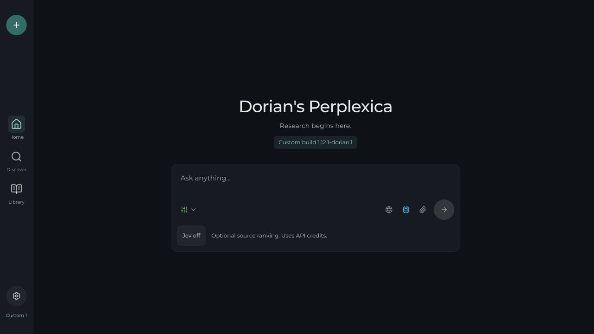

# Personal UI, Jev controls and search review

Release `1.12.1-dorian.1` includes the personal UI, Jev controls and search fixes below. Publishing this source release does not update Unraid. Rebuild and recreate the existing Compose service to install it, preserving its data mounts, then confirm the build number in Settings. No real credentials were added and no paid model requests were made during this review.

## Changes ready to review

- The home screen identifies Dorian's Perplexica and shows the full custom build number. The desktop sidebar has a compact release label, and Settings shows the build on both desktop and mobile. The familiar layout, existing fonts, themes, weather and news options remain.
- A muted teal accent marks new chat, active navigation, sending, keyboard focus and selection. Settings controls have accessible names and proper buttons. Mobile navigation accounts for the safe area.
- Image and video thumbnails retain their proportions when an external preview fails. Media buttons work with the keyboard, video frames have titles, and the gallery opens at the selected item without reordering the source list.
- Media searches show retry and empty states, recover after HTTP errors, and have a 45-second client deadline. This improves failure handling; it cannot make an unavailable external image host serve its thumbnail.
- Settings > Search has a Jev provider selector, a masked server-side API key field, and an enable switch. OpenRouter chat connection key fields now use password inputs as well. Keys are not saved in browser local storage. Settings responses redact password fields, and a masked save preserves the existing key.
- The question and follow-up boxes have a per-search Jev toggle. It starts off for a new chat, works in Balanced and Quality, and excludes uploaded files. A read-only status endpoint does not call the provider.
- New source lists save whether Jev affected the selected evidence. Context recovery retains completed ranking and page reads and labels their use. The API also accepts a boolean `useJev` option.



[Mobile preview](assets/personal-ui-mobile-2026-10-02.jpg), [mobile Jev settings](assets/jev-settings-mobile-2026-10-02.jpg), and [Web always on](assets/web-always-on-mobile-2026-10-02.jpg).

## What the Coraline test showed

The initial question completed and saved. It ran four search queries in two rounds, with 24 raw result entries and 10 final source documents after duplicates and limits. The saved citations point to valid source indices.

Quality was weaker than completion alone suggests. An unrelated adult-content page appeared as source 2, although the answer did not cite it. The answer mostly gave general background and plot information rather than concrete production trivia. LAIKA's official page was available, but reaction videos and generic social-media pages also occupied the source list.

Runtime logs show that three pages were scraped, then context processing aborted and fell back to raw search snippets. The writer therefore lost the extracted page evidence. The code's three-page budget and 15-second deadline match Speed mode. Some search engines also reported rate limits or CAPTCHA challenges.

The follow-up, "what is the meaning of the movie", completed with only an answer block. Web remained selected. It had no research block or sources and said that no search results were loaded. The relevant logs contained no search errors.

The likely cause is the classifier's `skipSearch` rule for general-knowledge questions. Both search agents bypass research when that flag is true. The actual classifier decision was not saved, so this conclusion is an inference from the completed record and code. A local reproduction confirmed the skip path even with Web selected. Previous answer text enters follow-up history, but its source evidence does not, leaving the writer unable to cite it.

The repeated Home/Discover rail in the supplied long screenshot was not reproduced. The live page has one visible navigation set; full-page capture stitching is the likely explanation.

## Search fixes added after the review

Every accepted query and follow-up now attempts a fresh web search, in every mode. The classifier cannot bypass it. Both chat and API agents include Web while preserving academic/discussion selections and attachments. The researcher performs its first search with the resolved follow-up before the model can choose to finish. It uses one existing research iteration, so mode budgets remain bounded. Web is labelled Always on in the source menu.

A failed required SearXNG request stops answer generation with an error. A valid empty response shows Found 0 results and can produce an explanation of the missing evidence. Cancellation still stops the required search. The new tests caught and fixed a promise-observation race during an immediate Stop.

Context deadlines now retain completed embedding/Jev ranking and successful page reads, including when a sibling page stalls or passage embedding fails. Follow-up ranking uses the resolved topic instead of a vague pronoun question. Source labels and structured recovery logs record which evidence survived. Redirected pages retain one final citation instead of duplicating the original snippet.

Long-page passage embedding is bounded to roughly twice the final chunk budget across pages, with a small allowance for rounding. A lexical preselection retains matching passages near the end of a page. If semantic ranking is unavailable, snippet recovery excludes snippets with no query-word overlap when matching snippets exist. It preserves the original candidates when none match. This is a bounded recovery heuristic, not a guarantee of relevance, fact checking, or publisher trust. Semantic paraphrases can be missed by lexical preselection; representative live queries still need comparison.

Completed semantic and Jev ranking bypass that lexical snippet filter. The final review caught a case where a medical synonym ranked first was discarded in favour of an unrelated literal keyword match when page reads failed. Two regression tests reproduce that failure and confirm that final evidence and saved checkpoints retain the completed ranking.

The Speed deadline remains 15 seconds, with three page reads. Balanced and Quality retain 45 seconds and larger reading budgets. Balanced is the sensible mode for the next quality comparison.

## Live testing after installing

1. Confirm `1.12.1-dorian.1` in Settings after rebuilding and recreating the service. Restarting the old image alone does not install these changes. Check the commit's Quality checks workflow for Linux build and container validation.
2. Use Balanced mode to repeat Coraline trivia and its meaning follow-up. Compare relevance, supported citations, retained page evidence, latency and search-engine failures. The earlier test is evidence of failure, not a controlled before/after benchmark.
3. Evaluate Jev off/on once a dedicated key is configured through Settings. Its integration is tested, but its real benefit and billable latency remain unmeasured. OAuth is a separate optional provider project and does not block these search fixes.

Jev is worth keeping as an optional relevance experiment. Its effect on this fork has not been measured with a real key. It reorders a shortlist; it does not verify facts, establish publisher trust, or remove every low-scoring source. OpenRouter bills its requests separately from a Codex subscription. See [Jev setup and evaluation](../installation/JEV.md).

## Codex subscription OAuth

OpenAI now documents optional ChatGPT plan usage for open-source and self-hosted apps. Eligible Plus/Pro access still needs an account sign-in and consent test. This fork has not connected an account. The feature does not grant access to ChatGPT conversation history. See [OpenAI's overview](https://developers.openai.com/siwc/token-sharing-open-source) and [Sign in with ChatGPT](https://developers.openai.com/cookbook/articles/sign-in-with-chatgpt).

The recommended implementation is a dedicated ChatGPT plan provider using the public Responses endpoint. Start with answer writing, preserve the existing embedding provider, then consider researcher and classifier calls after testing compatibility. Shared plan usage is limited, so show limit errors and avoid silently switching to a paid API provider. Available models should come from the signed-in account's catalog. See [models and inference](https://developers.openai.com/siwc/token-sharing-open-source/models-and-inference).

This needs its own OAuth registration, PKCE and refresh handling. For Unraid, complete the tool's sign-in locally and securely transfer that tool's protected session to the server, which keeps its own stable host ID. Do not copy the Codex app's credentials. OpenAI documents that local callback and remote-server arrangement in [self-hosted VMs](https://developers.openai.com/siwc/token-sharing-open-source/self-hosted-vms).

The current Chat Completions provider is not a compatible drop-in. The plan flow requires streaming Responses requests with `store: false`, handles system instructions differently, and supports a restricted parameter and tool set. Success requires a completed terminal event. See [preview limitations](https://developers.openai.com/siwc/token-sharing-open-source/preview-limitations). Embedding and Jev service usage remain separate.

## Verification and preview

- All 116 research tests passed after the search fixes. Six new tests cover saved Jev settings, redaction, validation, opt-out, status access and truthful fallback labels. Ten new context-recovery tests and mandatory-search tests cover the initial question, follow-up, all modes, early completion, failures and cancellation.
- TypeScript and the final production build passed on Node 24.21.0 and Next 16.3.6.
- Lint finished with zero errors and the existing 33 warnings.
- Desktop at 1280 × 720 and mobile at 390 × 844 were checked in light and dark themes. No horizontal overflow appeared. Keyboard access, settings, key masking, Jev eligibility, retry after a fixture HTTP failure, failed thumbnails and video frame titles were checked.
- The built app's local HTTP routes saved and reloaded two fixture chat answers, each with a web search, a source and citation. An API follow-up also searched, a deliberate SearXNG failure stopped the writer, and valid empty results were disclosed. The fixture classifier requested skipSearch and its researcher selected done immediately; the application still searched. Its config API returned the key mask, and the Jev status API exposed no key. A temporary dummy key was removed after testing. No real Jev inference was attempted.
- The UI detector reported no findings. Unrelated existing line-ending changes were preserved.

The local fixture preview is [http://127.0.0.1:3024](http://127.0.0.1:3024). It uses disposable data and a local model fixture. It is for UI review, not answer-quality testing. Its process command is:

```sh
DATA_DIR=/private/tmp/perplexica-search-fixes-20261002/runtime \
HOSTNAME=127.0.0.1 PORT=3024 \
node /private/tmp/perplexica-search-fixes-20261002/server/server.js
```

The local fixture service runs on port 4024. The Quality checks workflow validates Linux builds, full and slim Docker images, packaged Chromium, startup, migrations and assets after the push. This round does not deploy to Unraid. The search-skipping and discarded-evidence paths are fixed locally; their live answer-quality benefit remains unmeasured.
